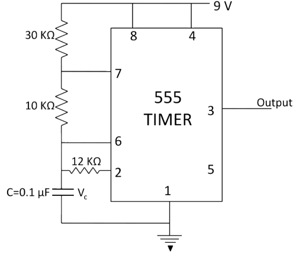

## Post test
#### Please attempt the following questions

Q1. An Astable Multivibrator has 
 
A      One stable state         
B      Two stable states        
<b>C      No stable state</b>        
D      None of the above        
 
  

Q2. The external triggering is not needed for the transition of state in the

A     Bistable multivibrator  
B     Monostable multivibrator  
<b>C     Astable multivibrator</b>  
D     Both b and c  
 
  

Q3. How to achieve 50 % duty cycle in adjustable rectangular wave generator? (Assume R1, Resistor connected between supply and discharge and R2, Resistor connected between discharge and trigger input.)

A     R1 < R2  
B     R1 > R2  
<b>C     R1 = R2</b>  
D     R1 ≥ R2  
 
  

Q4. When 555 Timer IC is configured as an astable multivibrator, its duty cycle is determined by

A     Internal resistors  
<b>B     External resistors</b>  
C     Capacitors  
D     Inductors  
 
  

Q5. What is the duty cycle of the waveform at the output of the circuit given below?

A     78%  
<b>B     56%</b>  
C     50%  
D     44%  
 
  

Q6. Find the charging and discharging time of 0.5 µF capacitor.

A     Charging time = 2ms, Discharging time = 5ms  
<b>B     Charging time = 5ms, Discharging time = 2ms</b>  
C     Charging time = 3ms, Discharging time = 5ms  
D     Charging time = 5ms, Discharging time = 3ms  
 
  

Q7. Determine the output frequency of the circuit.

A     1450 Hz  
B     1333 Hz  
<b>C     1871 Hz</b>  
D     1700 Hz  
 
  

Q8. Astable multivibrator cannot be used for frequency division?

A     True  
<b>B     False</b>  
 
  

Q9. An Astable multivibrator operating at 150 Hz has a discharge time of 2.5 ms. Find the duty cycle of the circuit. 

A     50 %  
B     75 %   
C     95.99 %  
<b>D     37.5 %</b>   
 
  

Q10. An astable multivibrator circuit using 555 Timer IC is shown below. Assume that the circuit is oscillating steadily from

  

A     3V to 5V  
<b>B     3V to 6V</b>  
C     3.6V to 6V  
D     3.6V to 5V  
