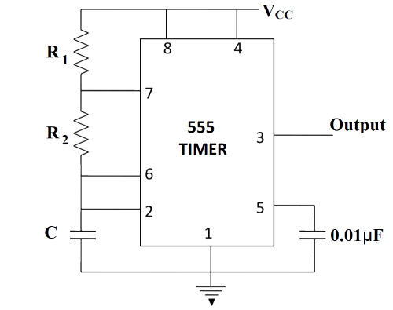

##  Pre Test 
#### Please attempt the following questions

Q1. What is the duty cycle of the output of an astable multivibrator?

<b>A  50 %</b>  
B  100 %  
C  75 %  
D  55 %  
 
  
  
Q2. The \_\_\_\_\_\_\_\_ is defined as the active output time divided by the total period of the output signal

A  On time  
B  Off time  
<b>C  Duty cycle</b>  
D  Active ratio  
 
  
  
Q3. An astable multivibrator requires

A  Balanced time constants.  
B  A pair of matched transistors.  
<b>C  No input signal.</b>  
D  Dual J-K flip-flops.  
 
  
  
Q4. How do we obtain a symmetrical waveform in Astable Multivibrator?
  
A  Use clocked RS flip-flop  
<b>B  Use clocked JK flip-flop</b>  
C  Use clocked D-flip-flop  
D  Use clocked T-flip-flop  
 
  
  
Q5. An astable multivibrator has

A  One quasi stable state  
<b>B  Two quasi stable states</b>  
C  No quasi stable state  
D  None of the above  
 
  
  
Q6. By using norm of potentiometer, which physical quantity of the square wave can be altered?

A  Amplitude  
<b>B  Frequency</b>  
C  Wavelength  
D  Speed  
 
  
  
Q7. Name the multivibrator that is most commonly used as relaxation oscillator.

A  Bistable multivibrator  
<b>B  Astable multivibrator</b>  
C  Monostable multivibrator  
D  None of the above   
 
  
   
Q8. An integrated circuit which is used in a variety of timer, pulse generation and oscillator applications is

<b>A  555 timer</b>  
B  7806IC  
C  7909IC  
D  225IC  
 
  
  
Q9. Free running frequency of Astable multivibrator is

<b>A  f = 1.45/(R1+2R2)C</b>  
B  f = 1.45(R1+2R2)C  
C  f = 1.45C/(R1+2R2)  
D  f = 1.45R1/(R1+R2)  
 
  
  
Q10. In an astable multivibrator using 555 Timer IC the capacitor always charges between

A  0 and Vcc   
B  0 and 2/3 Vcc  
<b>C  1/3 Vcc and 2/3 Vcc</b>  
D  None   

