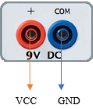
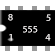
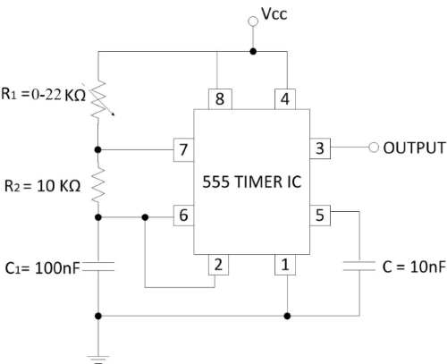
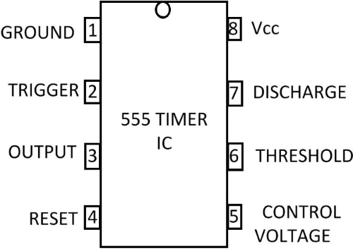
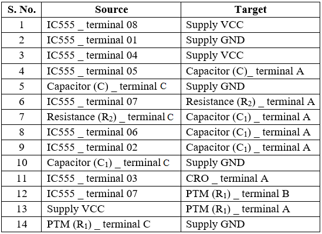

## Procedure
 

Click on **“Click Here”** in **Simulation** tab.  

1.  Click on the **Component** button to place components on the table.

&emsp; &emsp; &emsp; ")&emsp; ")&emsp; ")&emsp; ")&emsp;   

**Fig. 1 Components** 

  
2.  Make connections as per the circuit diagram and pin diagram of ICs or according to connection table
  
Note :- Connect,

&emsp; a.  1st leg of potentiometer to + 5 V power supply.  
&emsp; b.  2nd leg of potentiometer to pin 7 of IC.  
&emsp; c.  3rd leg of potentiometer to ground.  

**Fig. 2 Circuit diagram of an astable multivibrator**

**Fig. 3 Pin diagram of 555 Timer IC**

**Table 1: Connection table**

 

  
3.  Connect the C.R.O on output terminal of circuit.
4.  Click on **Check Connections** button. If connections are right, click on **‘OK’**, then **Simulation** will become active.
5.  Set R1 = 5 KΩ by using potentiometer knob.
6.  Connect **CH1/CH2** of C.R.O. to output terminal of the circuit.
7.  Observe output wave on C.R.O by adjusting C.R.O channel **CH1/CH2** and **TIME** knobs.
8.  Use **X** Shift and **Y** Shift buttons for wave shifting.
9.  Measure the frequency of output wave at C.R.O.
10.  Fill the observation table by required values.
11.  Repeat steps **5, 6, 7, 8 and 9** for the different values of R1 = 10 KΩ, 15 KΩ and 20 KΩ.
12.  Compare both experimental and theoretical frequencies.
13.  Click on the **Reset** button to reset the page.

