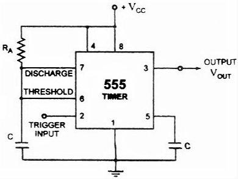
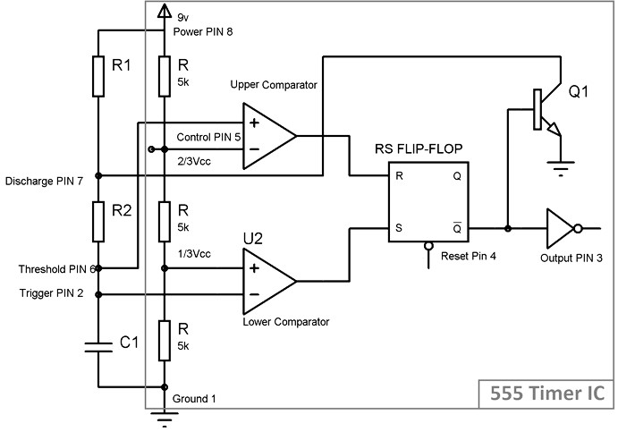
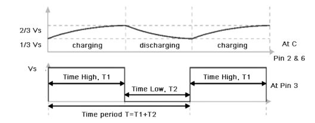

<h2>Introduction</h2>

A multivibrator is a one type of electronic circuit, that is used to implement a two state system like flip-flops, timers and oscillators. Multivibrators are categorized by two amplifying devices like electron tubes, transistors and other devices like capacitors and cross coupled by resistors. Multivibrators are classified into three types based on the circuit operation, namely Astable multivibrators, Bistable multivibrators and Monostable multivibrators. The astable multivibrator is not stable and it repeatedly switches from one state to the other. In monostable multivibrator, one state is stable and remaining state is unstable. A trigger pulse is the root to the circuit to enter the unstable state. When the circuit enters into the unstable state, then it will return to the normal state after a fixed time. A bistable mutivibrator circuit is stable that can be changed from one stable to other stable by an external trigger pulse. This multivibrator circuit is also called as flip-flop which can be used to store one bit of data.

### Monostable Multivibrator

Monostable multivibrators have only one stable state that is used to generate a single o/p pulse of a specified width either high or low when an external trigger pulse is applied. This trigger pulse starts a timing cycle, which causes the o/p to change its state at the time of start of timing cycle and continues in the second state which is decided by the time constant of the capacitor C and resistor R until it returns to its original state. It will continue in this state until another i/p signal is received. Monostable multivibrators can produce a much longer rectangular waveform. When a trigger pulse is applied externally then the leading edge of the waveform rises with the externally applied trigger. Here, trailing edge depends upon the RC time constant of the feedback components used. This RC time constant may be varied with time to produce a series of pulses which have a fixed time delay to the original triggered pulse.

### Circuit Connections of Monostable Multivibrator with 555 Timer

Fig.1 Monostable Mutivibrator using 555 IC Timer
 

In the above circuit, the pin1 is connected to the ground and the trigger input is given to the pin2.In inactive condition of o/p, this i/p is kept at +VCC. To get transition of the output from a stable state to unstable state, a negative going pulse of narrow width and amplitude of greater than +2/3 VCC is applied to pin2. The o/p is taken from pin3 and pin4 is connected to +VCC to avoid accidental reset.Pin5 is connected to the ground via a 0.01uF capacitor to avoid noise. Pin6 and pin7 are shorted and a resistor is connected between pins 6 and 8. A discharge capacitor is connected to pin7 while pin8 is connected to VCC.

### Working of Monostable Multivibrator with 555 Timer Circuit

The output of the monostable multivibrator using 555 timer remains in its stable state until it gets a trigger. In monostable 555 multivibrator, when both the transistor and capacitor are shorted then this state is called as a stable state. When the voltage goes below at the second pin of the 555 IC, the o/p becomes high. This high state is called quasi stable state. When the circuit activates then the transition from a stable state to quasi stable state. Then the discharge transistor is cut off and capacitor starts charging to VCC. Charging of the capacitor is done via the resistor R1 with a time constant R1C1. Hence, the voltage of the capacitor increases and finally exceeds 2/3 Vcc, it will change the internal control flip flop, thereby turning off the 555 timer IC. Thus the o/p goes back to its stable state from an unstable state. 

The Time duration of the pulse is given by

<b>T = 1.1RC</b>

Where, R is in Ω and C in Farads.

Finally we can conclude that, in the monostable multivibrator using 555 timer, the o/p stays in a low state until it gets a trigger i/p. This type of operation is used in push to operate systems. When  the input is triggered, then the o/p  will go to high state & comes back to its original state.

### Advantages of Monostable Multivibrator

1. It needs only one single pulse to start its operation there is no need of extra pulse for its operation.
2. Its construction is very simple and can be constructed easily.
3. Due to simple construction its price is also less.

### Disadvantages of Monostable Multivibrator

The major drawback of using a monostable multivibrator is that the time between the applications of trigger pulse T has to be greater than the RC time constant of the circuit.

### Applications of Monostable Multivibrator

1. Due to time delay capability, it is mostly used in different timer circuits.
2. It also used in different storage circuits.
3. It also used to provide input to other pluse generator circuits.
4. It also has ability to reproduce damage pulses again.

### Astable Multivibrator

An astable multivibrator is also known as a free-running multivibrator. It is called free-running because it alternates between two different output voltage levels during the time it is on. The output remains at each voltage level for a definite period of time. If you looked at this output on an oscilloscope, you would see continuous square or rectangular waveforms. The astable multivibrator has two outputs, but no inputs.

### Working of Astable Multivibrator with 555 Timer Circuit

Fig.2 Waveform of Astable Mutivibrator
 

When initially power is turned ON, Trigger Pin voltage is below Vcc/3, that makes the lower comparator output HIGH and SETS the flip flop and output of the 555 chip is HIGH. This makes the transistor Q1 OFF, because Qbar, Q’=0 is directly applied to base of transistor. As the transistor is OFF, capacitor C1 starts charging and when it gets charged to a voltage above than Vcc/3, then Lower comparator output becomes LOW (Upper comparator is also at LOW) and Flip flop output remains the same as previous (555 output remains HIGH). 

Now when capacitor charging gets to voltage above than 2/3Vcc, then the voltage of non-inverting end (Threshold PIN 6) becomes higher than the inverting end of the comparator. This makes Upper comparator output HIGH and RESETs the Flip flop, output of 555 chip becomes LOW. As soon as the output of 555 get LOW means Q’=1, then transistor Q1 becomes ON and short the capacitor C1 to the Ground. So the capacitor C1 starts discharging to the ground through the Discharge PIN 7 and resistor R2. 

As capacitor voltage get down below the 2/3 Vcc, upper comparator output becomes LOW, now SR Flip flop remains in the previous state as both the comparators are LOW.
While discharging, when capacitor voltage gets down below Vcc/3, this makes the Lower comparator output HIGH (upper comparator remain LOW) and Sets the flip flop again and 555 output becomes HIGH. Transistor Q1 becomes OFF and again capacitor C1 starts charging. 

Fig.3 Waveform of Astable Mutivibrator
 

This charging and discharging of capacitor continues and a rectangular oscillating output wave for is generated. While capacitor is getting charge the output of 555 is HIGH, and while capacitor is getting discharge output will be LOW. So this is called Astable mode because none of the state is stable and 555 automatically interchange its state from HIGH to LOW and LOW to HIGH, so it is called Free running Multivibrator.

Now, the OUTPUT HIGH and OUTPUT LOW duration, is determined by the Resistors R1 & R2 and capacitor C1. This can be calculated using below formulas:

<b>Time High (Seconds) T1 = 0.693 * (R1+R2) * C1</b>
 

<b>Time Low (Seconds) T2 = 0.693 * R2 * C1</b>
 

<b>Time Period T</b> = Time High + Time Low <b>= 0.693 * (R1+2*R2) * C1</b>
 

<b>Freqeuncy f</b> = 1/Time Period  <b> = 1/ 0.693 * (R1+2*R2) * C1 = 1.44 / (R1+2*R2) * C1</b>
 

<b>Duty Cycle:</b> Duty cycle is the ratio of time for which the output is HIGH to the total time.

<b>Duty cycle %:</b> (Time HIGH/ Total time) * 100 <b>= (T1/T) * 100 = (R1+R2)/ (R1+2*R2) *100</b>
 
    
### Advantages of Astable Multivibrator

1. No external triggering required.
2. Circuit design is simple.
3. Inexpensive.
4. Can function continuously.

### Disadvantages of Astable Multivibrator

1. Energy absorption is more within the circuit.
2. Output signal is of low energy.
3. Duty cycle less than or equal to 50% can’t be achieved.

### Applications of Astable Multivibrator

Astable Multivibrators are used in many applications such as amateur radio equipment, Morse code generators, timer circuits, analog circuits, and TV systems.