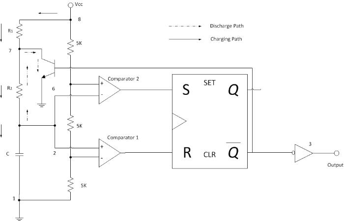

### Introduction

A multivibrator circuit is basically a non-sinusoidal oscillator with a regenerative feedback. It is a two state circuit that has zero, one or two stable output states. Depending on the number of stable output states there are three basic types of multivibrator circuits namely monostable multivibrato (having one stable state), bistable multivibrator (having two stable states) and astable multivibrator (having no stable states).  
Astable multivibrator continuously switches between two states without application of any external trigger hence is also called "Free Running Multivibrator". The 555 Timer IC can be made to work as an astable multivibrator with the addition of three external components- two resistors (R1 and R2) and a capacitor (C).

### **555 Timer IC**

555 Timer IC is the most commonly used IC for timing and pulse generation applications. It can adopt itself into various applications due to its different operating modes. This IC consists of 25 transistors, 2 diodes and 15 resistors. When compared to the applications of an op-amp in the same areas, the 555 Timer IC is equally reliable and is cheap in cost. There are three resistors of value 5 KΩ, which gives this IC its iconic name “555 Timer”. It has dual comparators and flip-flop which make this IC operated in three different modes viz. astable, monostable and bistable (Schmitt) mode. Apart from its applications as a multivibrators, a 555 Timer IC can also be used in digital logic probes, waveform generators, analog frequency meters and tachometers, temperature measurement and control devices, voltage regulators, etc.

#### **Important features of 555 Timer IC**

*   The duty cycle of the 555 Timer IC is adjustable.
*   Sinking or sourcing 200 mA of load current.
*   It operates from a wide range of power supplies ranging from +5 V to +18 V.
*   The external components should be selected properly so that the timing intervals can be made into several minutes along with the frequencies exceding several hundred kilohertz.
*   The output of a 555 Timer IC can drive transistor-transistor logic (TTL) due to its high current output.
*   It has a temperature stability of 50 parts per million (ppm) per degree Celsius change in temperature or equivalently 0.005 %/ °C.
*   The maximum power dissipation per package is 600 mW and its trigger and reset inputs have logic compatibility.

#### **PIN CONFIGURATION OF 555 TIMER IC**

The pin diagram of 555 timer IC is shown in fig. 1 

**Fig. 1 Pin diagram of 555 Timer IC** 

1.  **Pin 1: Ground Terminal-** All the voltages are measured with respect to the Ground terminal.
2.  **Pin 2: Trigger Terminal-** The trigger pin is used to feed the trigger input hence the 555 Timer IC is set up as a monostable multivibrator. This pin is an inverting input of a comparator and is responsible for the transition of flip-flop from set to reset. The output of the timer depends on the amplitude of the external trigger pulse applied to this pin. A negative pulse with a DC level greater than Vcc/3 is applied to this terminal. In the negative edge, as the trigger passes through Vcc/3, the output of the lower comparator becomes high and the complimentary of Q becomes zero. Thus the 555 Timer IC's output gets a high voltage and thus a quasi stable state.
3.  **Pin 3: Output Terminal-** Output of the timer is available at this pin. There are two ways in which a load can be connected to the output terminal. One way is to connect between output pin (Pin 3) and ground pin (Pin 1). Another way is to connect between Pin 3 and supply pin (Pin 8). The load connected between output and ground supply pin is called the "normally on load" and that connected between output and ground pin is called the "normally off load".
4.  **Pin 4: Reset Terminal-** Whenever the timer IC is to be reset or disabled, a negative pulse is applied to Pin 4 and thus is named as reset terminal. The output is reset irrespective of the input condition. When this pin is not to be used for reset purpose, it should be connected to +Vcc to avoid any possibility of false triggering.
5.  **Pin 5: Control Voltage Terminal-** The threshold and trigger levels are controlled using this pin. The pulse width of the output waveform is determined by connecting a potentiometer or bringing in an external voltage to this pin. The external voltage applied to this pin can also be used to modulate the output waveform. Thus, the amount of voltage applied to this terminal will decide when the comparator is to be switched and thus changes the pulse width of the output. When this pin is not used, it should be bypassed to ground through a 0.01 μF capacitor to avoid any noise problem.
6.  **Pin 6: Threshold Terminal-** This is the non-inverting input terminal of comparator 1, which compares the voltage applied to the terminal with a reference voltage of 2/3 Vcc. The amplitude of voltage applied to this terminal is responsible for the set state of flip-flop. When the voltage applied in this terminal is greater than 2/3 Vcc, the upper comparator switches to +V sat and the output gets reset.
7.  **Pin 7: Discharge Terminal-** This pin is connected internally to the collector of transistor and mostly a capacitor is connected between this terminal and ground. It is called discharge terminal because when transistor saturates, capacitor discharges through the transistor. When the transistor is in cut-off region, the capacitor charges at a rate determined by the external resistor and capacitor.
8.  **Pin 8: Supply Terminal-** A supply voltage of +5 V to +18 V is applied to this terminal with respect to ground (Pin 1).

### **Circuit and its operation**

The schematic of the 555 Timer IC as an astable multivibrator along with the three external components R1, R2 and C is shown in fig 2. This circuit is not stable in any state and switches outputs after predetermined time periods. The result of this is that the output is a continuous square/rectangular wave with properties depending on values of external resistors and capacitors.  

  

**Fig. 2 Circuit diagram of an astable multivibrator** 

  

Pins 2 and 6 are connected and hence there is no need for an external trigger pulse. The rest of the connections are as follows :-  
Pin 8 is connected to supply voltage (Vcc).  
Pin 3 is the output terminal and hence the output is available at this pin.  
Pin 4 is the external reset pin. A momentary low on this pin will reset the timer. Hence when not in use, Pin 4 is usually tied to Vcc.  
The control voltage applied at Pin 5 will change the threshold voltage level. But for normal use, Pin 5 is connected to ground via a capacitor (usually 0.01µF), so the external noise from the terminal is filtered out.  
Pin 1 is ground terminal.  
The timing circuit that determines the width of the output pulse is made up of R1, R2 and C.  
The following schematic (fig. 3) depicts the internal circuit of the 555 Timer IC operating in astable mode. The RC timing circuit incorporates R1, R2 and C.

  
  

**Fig. 3 Internal circuit of the 555 timer IC operating in astable mode** 

Initially on power up the flip-flop is RESET (and hence the output of the timer is low). As a result, the discharge transistor is driven to saturation (as it is connected to Q'). The capacitor(C) of the timing circuit is connected at Pin 7 of the 555 Timer IC and will discharge through the transistor. The output of the timer at this point is low. The voltage across the capacitor is nothing but the trigger voltage. So while discharging, if the capacitor voltage becomes less than 1/3 Vcc, which is the reference voltage to trigger comparator (comparator 2), the output of the comparator 2 will become high. This will SET the flip-flop and hence the output of the timer at Pin 3 goes to HIGH.  
This high output will turn OFF the transistor. As a result, the capacitor(C) starts charging through the resistors R1 and R2. Now the capacitor voltage is same as the threshold voltage (as pin 6 is connected to the capacitor-resistor junction). While charging, the capacitor voltage increases exponentially towards Vcc and the moment it crosses 2/3rd Vcc, which is the reference voltage to threshold comparator (comparator 1), its output becomes high.  
As a result, the flip-flop is RESET. The output of the timer falls to LOW. This low output will once again turn on the transistor which provides a discharge path to the capacitor. Hence the capacitor(C) will discharge through the resistor R2. And hence the cycle continues.  
Thus when the capacitor is charging, the voltage across the capacitor rises exponentially and the output voltage at Pin 3 is high. Similarly, when the capacitor is discharging, the voltage across the capacitor falls exponentially and the output voltage at Pin 3 is low. The shape of the output waveform is a train of rectangular pulses. The waveforms of capacitor voltage and the output in the astable mode are shown in fig. 4 as below.  

**Fig. 4 Waveforms of capacitor voltage and the output in the astable mode** 

  

While charging, the capacitor charges through the resistors R1 and R2. Therefore the charging time constant is (R1 + R2)\*C as the total resistance in the charging path is (R1 + R2). While discharging, the capacitor discharges through the resistor R2 only. Hence the discharge time constant is R2C.  
As shown in the fig. 4, the capacitor is periodically charged and discharged between 2/3 Vcc and 1/3 Vcc respectively. The time during which the capacitor charge from 1/3 Vcc to 2/3 Vcc is equal to the time the output is high and is given by-  

Tc = 0.69(R1 + R2)C ………………..(a) 

where R1 and R2 are in ohms(Ω) and C is in Farad(F). Similarly, the time during which the capacitor discharges from 2/3 Vcc to 1/3 Vcc is equal to the time the output is low and is given by-  

Td = 0.69(R1)C ……………………..(b) 

Thus the total period of output waveform is-  

T = Tc + Td  
T = 0.69(R1 + 2R2)C………….(c) 

Thus frequency of Oscillation is given by-  

F = 1/T = 1.44/(R1 + 2R2)C ……………………………..(d) 

### **Duty Cycle**

The charging and discharging time constants depends on the values of the resistors R1 and R2. Generally, the charging time constant is more than the discharging time constant. Hence the HIGH output remains longer than the LOW output and therefore the output waveform is not symmetric. Duty cycle is the mathematical parameter that forms a relation between the high output and the low output.  
Duty Cycle is defined as the ratio of the time Tc during which the output is high to the total time period, T. It is generally expressed as percentage.Thus duty cycle in terms of percentage is given as  

DC (%) = (Tc × 100)/T = \[(R1 + R2)/(R1 + 2R2)\]× 100……………………….(e) 

### **Applications of Astable Multivibrator**

#### **Square Wave Generation**

The duty cycle of an astable multivibrator is always greater than 50 %. A square wave is obtained as the output of an astable multivibrator when the duty cycle is exactly 50 %. Duty cycle of anything less than that of 50 % is not possible with the 555 Timer IC as an astable multivibrator mentioned above.

#### **Pulse Position Modulation**

In pulse position modulation, the position of the pulse varies according to the modulating signal while the amplitude and the width of the pulse are kept constant. The position of the each pulse changes according to the instantaneous samples voltage of the modulating signal. In order to achieve Pulse Position Modulation, two 555 timer IC’s are used in which one operates in astable mode and the other in monostable mode.

#### **Pulse Train**

We know that astable multivibrator will generate continuous stream of pulses. By using a potentiometer in place of R1, a train of pulses can be generated different widths.

#### **Frequency Modulation**

Astable multivibrator can be used to generate frequency modulated signals. A modulating signal is given to the Pin 5 (control voltage). A diode is connected in parallel to the resistor R2 in order to generate a pulse output with duty cycle ≈ 50%. The modulation signal is applied at Pin 5 through a high pass filter consisting of a capacitor and a resistor. According to the modulating signal applied at Pin 5, the output will be frequency modulated. If the voltage of the modulating signal is high, the time period of the output signal is high and if the voltage of the modulating signal is low, the time period is low. The waveforms of the modulation signal and the frequency modulated signal are shown in fig. 5 as below.

  

**Fig. 5 Waveforms of the modulation signal and the frequency modulated signal** 

